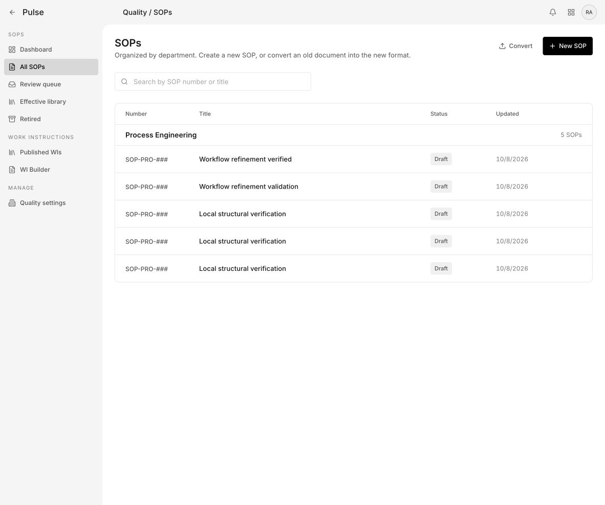
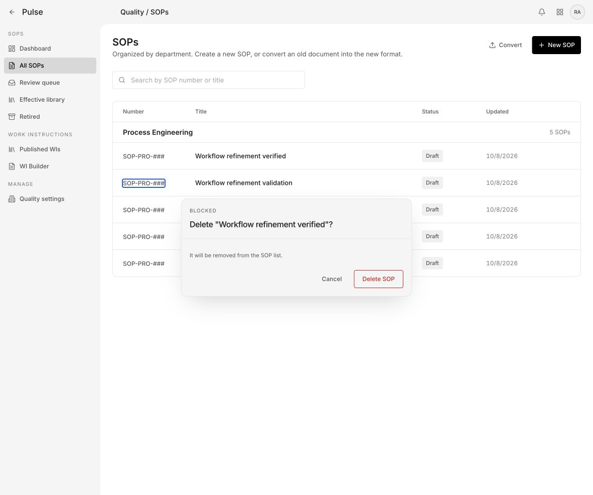
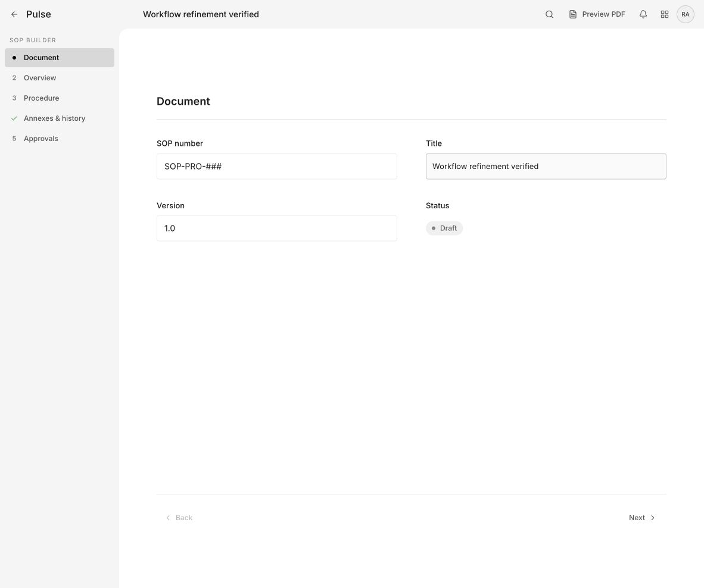
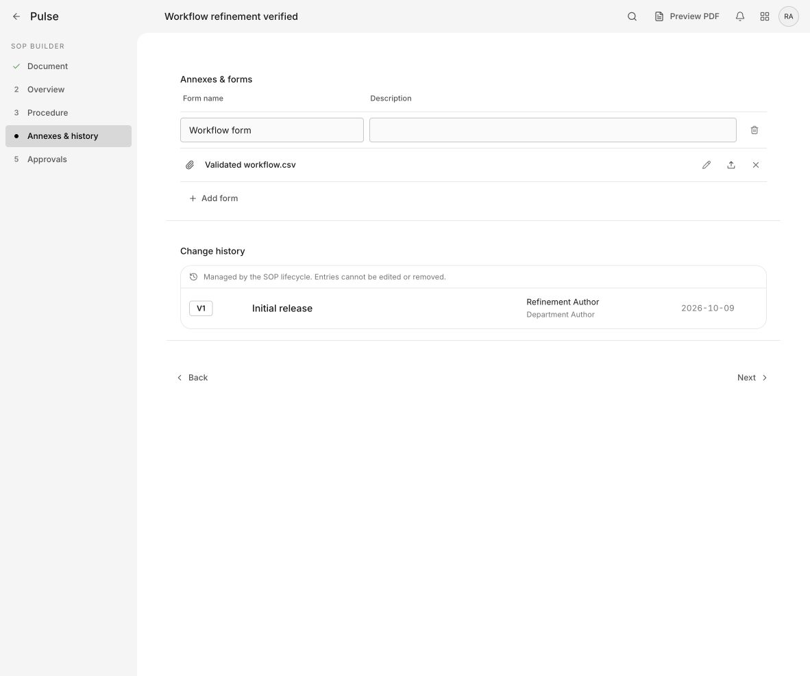
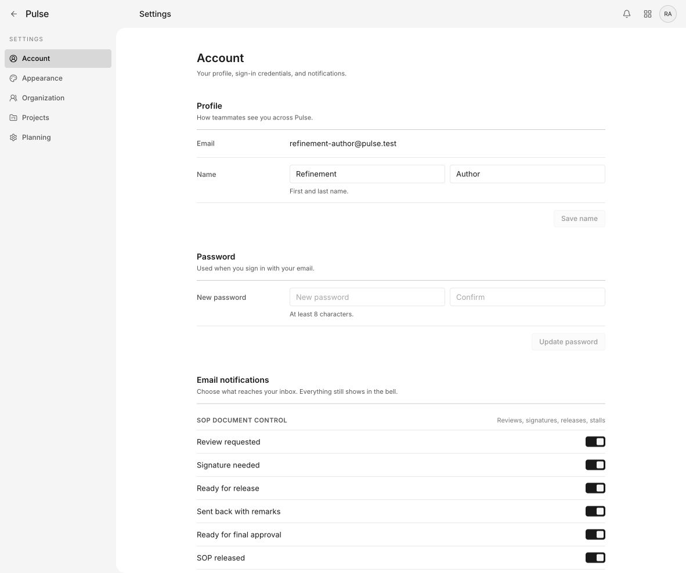
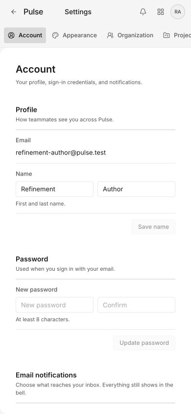
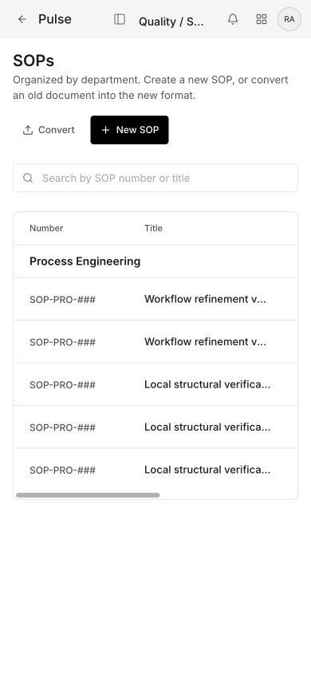

# Pulse UI component audit and cleanup plan

Audit baseline: `e47add77cf38ab2cc54288bb824219bafeeabfb1`, branch `codex/ui-component-audit`.

## Conclusion

Pulse has a recognizable shared visual language, reusable styles, and deliberate state retention. The next useful pass is **shared interaction behavior and explicit lifecycle contracts**, rather than a wholesale redesign or splitting files to meet a line target. Start with confirmations, then background activity, then controls. Preserve save ownership, navigation state, recovery, permissions, and existing feature-specific behavior.

This is an audit only. No application code was changed. The inspected local app on port 3216 and this audit checkout resolve to the same commit. Browser actions used synthetic local data, opened and cancelled a confirmation, and navigated screens; no deletion or form submission occurred. No live environment was accessed.

## Inventory and counting method

`inventory.json` records every production `.tsx` file under `src/components`, excluding `.test.tsx` and `.spec.tsx`, with line counts and TypeScript-parser JSX tag counts (comments excluded). These are source occurrences, **not rendered control counts or distinct React component types**. A mapped button may render many times; a file may export multiple components. Route files outside this directory are excluded from these counts.

| Measure | Count |
|---|---:|
| All files under src/components, including helpers/tests/styles | 310 |
| Production TSX files | 177 |
| Button JSX occurrences | 573 |
| Input / textarea / native select occurrences | 180 / 24 / 9 |
| Table JSX occurrences | 50 |
| Native dialog JSX occurrences | 4 |
| Explicit dialog/alertdialog role occurrences | 22 |
| Files containing native or ARIA dialog markup | 23 |

Native dialogs sometimes also have an explicit role, so the dialog counts overlap. These counts indicate the review surface; they do not mean there are 573 button designs or 23 broken dialogs.

### Eight practical component families

| Family | Existing homes and variants | Consolidation direction |
|---|---|---|
| Buttons and icon actions | Four core styles in `app/globals.css:1710`: primary, secondary, ghost, destructive; SOP AddButton/RowDeleteButton; local icon controls | Keep visual variants. Introduce a small Button/IconButton contract for labels, size, disabled and pending behavior; migrate repeated cases gradually. |
| Text and numeric fields | ui-input, ui-field-standalone, section-specific overrides, ClearableNumberInput, SOP fields | Shared field label/help/error association and explicit density variants; preserve numeric clearing and validation semantics. |
| Selection controls | ThemedSelect, native select, specialized mobile tool picker, switches | Keep native/simple, searchable, and multi-item workflows distinct; reuse behavior only when contracts match. |
| Dialogs, drawers, previews | ThemedFeedbackLayer, native dialog viewers/drawer, custom photo and editor overlays | One accessible modal foundation, with specialized content and explicit close/pending rules. Do not force popovers and modals into the same semantics. |
| Loading and feedback | Nothing UI, QuietLoading, space-loading-states, toasts, save statuses | Define usage policy: inline action, content load, initial shell, persistent save/recovery. Preserve contextual skeleton shapes. |
| Navigation and retained panels | SOP workspace, Settings panel, Planning persistent layout, navigation track | Preserve first-use mounting and visited state; expose visibility separately from mount state. |
| Tables, cards and lists | SOP table, planning boards, procedure/tool tables, settings sections | Share empty/error/header pieces first; do not build one generic table that absorbs every workflow. |
| Media and specialized editors | Photo viewer/crop/export, PDF viewers, procedure editors, Gantt | Share overlay and control behavior; retain domain interactions and loading boundaries. |

`space-loading-states.tsx` exports 12 functions and one alias (`PeopleLoadingState = SettingsLoadingState`); that alias is not a separate implementation. QuietLoading intentionally reserves layout space with accessible status rather than animated bars. Multiple loaders are not automatically duplication.

## Confirmed findings and priorities

### 1. High: shared confirmation does not contain keyboard focus

**Reproduced locally.** In All SOPs, open Delete SOP without confirming. Focus remains on the triggering row. Pressing Tab moves to the next SOP link behind the visible modal. The screenshot shows that background link's focus outline while the confirmation is open. Cancelled afterward; no record deleted.

Source: `src/components/themed-feedback.tsx:141`, Escape listener at 168–181; dialog markup at 277 and 305. There is no initial focus, focus trap, background inertness, or restoration mechanism in this component.

**Change:** establish a modal foundation that moves focus to a safe initial action, confines Tab/Shift+Tab, makes background interaction unavailable, and restores focus to the opener. Preserve current cancel/confirm callbacks, pending rules and anchored placement. Decide whether anchored confirmations are modal or nonmodal and implement matching semantics. Test nested dropdown Escape so only the top layer closes.

**Acceptance:** keyboard cannot activate a background SOP while confirmation is open; Escape cancels; Cancel restores focus; confirm fires once; pending behavior stays intact. Start here because a shared fix benefits multiple workflows.

### 2. Medium: backup status polling can continue in a hidden Settings panel

**Source-confirmed; running-backup runtime scenario not exercised.** Settings retains visited sections (`app-settings-panel.tsx:353`, hidden backup wrapper at 391). BackupSettings polls `/api/backups` every three seconds while a backup is running (`backup-settings.tsx:19–25`), without active-panel or document-visibility gating. That is nominally 20 refresh attempts per minute while the interval runs, subject to browser throttling and request duration. This is a specific conditional case, not evidence of widespread request abuse.

**Change:** keep the backup operation running independently, but pause panel-only polling while hidden and refresh immediately on return. If global completion notification is required, assign it to one shared owner rather than silently removing it. Prevent overlapping refreshes on slow responses.

**Acceptance:** backup continues and completes after navigating away; hidden panel does not run its own timer; returning shows current state; no duplicate pollers or lost download availability. Test using a local stub, not a production backup.

### 3. Medium: crop resize buttons have pointer behavior without keyboard adjustment

**Source-confirmed, not exercised in the browser.** `photo-overlay-crop-editor.tsx:39–60` renders focusable resize buttons but attaches only pointer-down handlers. The enclosing key handler handles Escape, not arrow adjustments. Keyboard users can reach a resize handle but cannot use it to adjust the crop.

**Change:** support named edge/corner arrow actions or numeric crop controls, with bounds identical to pointer behavior. Preserve original image data and the existing crop-coordinate contract. Verify inside the parent photo overlay because it has its own keyboard handling.

**Acceptance:** keyboard-only crop adjustment, Reset, Cancel and Done work; pointer cropping remains identical; Escape affects the correct layer; save/reopen preserves coordinates.

### 4. Medium: shared select positioning assumes room below the trigger

**Source-confirmed geometry risk, not a reproduced visual failure.** `themed-select.tsx:161–205` positions below the trigger and imposes a minimum menu height of 160px even when less vertical space remains. It listens to viewport changes but does not flip upward. A low trigger or on-screen keyboard can put options outside the available viewport.

**Change:** calculate available space above/below, flip when appropriate, and clamp height to actual space. Preserve portal targeting inside native dialogs, selected-option focus, search/create behavior, and focus return.

**Acceptance:** low-screen triggers and a reduced visual viewport keep options reachable; menus inside native dialogs remain interactive; Arrow/Home/End/Escape behavior and selection callbacks stay unchanged. Reproduce with a small fixture before implementation.

### 5. Low: destructive confirmation is visually labelled “BLOCKED” even when allowed

**Reproduced locally.** The delete confirmation displays “BLOCKED” above an enabled Delete SOP action. `themed-feedback.tsx:40–60` maps danger tone to Blocked; the modal falls back to this tone label at 310. Color/tone and workflow state are conflated.

**Change:** use an explicit confirmation label such as “Confirm deletion”; reserve blocked language for genuinely unavailable actions. Keep permission and deletion checks unchanged.

**Acceptance:** allowed confirmation and actual blocked/error states communicate different meanings, without changing what the action permits.

### 6. Medium maintenance opportunity: reusable styles do not enforce reusable behavior

**Source observation, not a defect count.** The core four button classes already share typography, shape and focus styling, but hundreds of local button/input instances repeat sizing, labels, disabled/pending treatment and overlay wiring. AWI details (`awi-editor-actions.tsx:51`) implements its own modal with autofocus and Escape but no local focus containment; the photo viewer has more complete focus handling (`step-photo-viewer.tsx:729–758`). This unevenness is why central interaction contracts matter more than cosmetic renaming.

**Change:** migrate shared confirmations first, then one small Button/IconButton and field contract with documented variants. Use existing tokens. Avoid converting every native control in one commit or hiding business operations inside UI primitives.

**Acceptance:** demonstrate enabled, disabled, pending, error, keyboard and narrow-screen states in a local component fixture. Feature callbacks and forms retain their behavior. Specialized canvases and dense tables retain explicit density options.

## Mounting assessment: what to keep

- **SOP tabs:** `sop-workspace.tsx:103–139` mounts visited tabs and warms code chunks during idle without eagerly mounting unseen panels. Active props are passed to panels. List, review queue and dashboard periodic refreshes are active-gated and check page visibility. Keep these protections.
- **Settings:** retains visited sections. This preserves edits and avoids repeated loading. Add explicit activity contracts where side effects require them; do not unmount everything to reduce memory.
- **Planning:** persistent navigation and per-workspace provider caches already separate shell and data lifetime. Preserve scope keys and server-seeded loading.
- **ThemedSelect:** open-only listeners have cleanup, selected focus and native-dialog portal handling. Fix geometry without replacing working behavior indiscriminately.
- **Photo viewer:** contains explicit focus trapping/restoration. Treat it as evidence of desired behavior, while testing specialized nested editors separately.
- A hidden panel may intentionally respond to data invalidation. For example, SOP dashboard has a demand-update listener in addition to its active-gated timer. Do not call every hidden update a leak: assess freshness requirements before replacing it with a dirty-on-return flag.

No profiler trace, heap measurement, bundle comparison, or production request sample was collected. This audit does not establish a measured speed improvement, render bottleneck, memory leak, or database request reduction beyond the source-level opportunity above.

## Current-run visual walkthrough

Desktop captures use the browser's normal 1182×988 viewport; narrow captures use 390×844. Temporary viewport override was reset. Screenshots were captured and inspected in this run.

1. **All SOPs — generally consistent.** Clear title/actions, restrained table and shared navigation. Search and primary action hierarchy are recognizable. No cosmetic overhaul indicated.
   
2. **Delete confirmation — needs correction.** Background focus and misleading Blocked label are reproduced. The screenshot shows focus on the next SOP behind the modal.
   
3. **Document editor — generally consistent.** Dedicated navigation and spaced fields; read-only metadata differs from editable title. Preserve this distinction in a shared field system.
   
4. **Annex controls — coherent, specialized controls worth preserving.** Field row, attachment actions and lifecycle history form clear groups. These should share primitives without moving persistence into presentation components.
   
5. **Account settings — coherent desktop and narrow layouts.** Fields reflow and navigation becomes a horizontal strip. This is a deliberate variant, not a duplicate screen to merge away.
   
   
6. **Narrow SOP list — usable but requires horizontal exploration.** Titles truncate and status/actions sit to the right in a horizontally scrollable table. A compact mobile row is an optional usability improvement, not a necessary refactor. Preserve access to every action if pursued.
   

Visual coverage is representative, not every route, theme, permission role or component state. Mobile capture, Gantt, production stations and media editing were source-inspected where referenced, not visually certified in this run. Screenshots alone do not establish contrast compliance, screen-reader compatibility, real-device touch behavior or acceptable performance.

## Recommended implementation sequence

| Phase | Scope | Why first / dependency | Exit criteria |
|---|---|---|---|
| 1. Correct shared confirmations | Focus ownership, background inertness, Escape/restore, danger-label wording; then migrate AWI dialogs after contract tests | Confirmed user-facing issue and reusable foundation | Keyboard regression checks and local SOP/AWI cancel/confirm checks; no altered write paths |
| 2. Make activity explicit | Backup panel visibility and single-flight polling; audit remaining retained effects against a small lifecycle checklist | Concrete avoidable work without sacrificing retained state | Hidden/visible/return/slow-request checks; operation still completes; local request counts before/after |
| 3. Strengthen input interactions | Select viewport geometry and keyboard crop controls; Button/IconButton/field contracts; migrate two representative screens | Fix behavior before widening reuse | Desktop/narrow/keyboard fixtures, loading/error/disabled checks; no visual or save regressions |
| 4. Measure and extend selectively | Baseline route transitions, render profiles, request counts and retained memory; expand migration only where duplication or cost is proven | Prevent speculative memoization/lazy loading and a giant generic component | Same fixtures before/after; preserved state and request budgets; measured benefit for any performance claim |

Each phase should be a small reviewable change. Unit/interaction tests cover contracts; local browser checks cover keyboard, navigation, save/reopen and upload behavior affected by that phase. Run type/lint/build checks appropriate to the changes. Do not rerun unrelated database operations for a styling-only migration. Do not merge or deploy during this audit.

## Definition of success

- One reliable home for modal behavior, field association and common button state behavior.
- Feature modules keep save/recovery/permission ownership; UI modules receive focused data and named actions.
- A retained panel can keep its state without silently owning unnecessary background work.
- Existing look and workflows remain familiar, except deliberate accessibility fixes and clearer wording.
- Performance claims are based on comparable measurements, not smaller files.
- The inventory becomes a migration checklist; completion is based on consistent contracts, not converting every component to a universal abstraction.

## Implementation checkpoint

The confirmed behavior fixes are implemented in the audit worktree. See [behavior closeout](fixes/behavior-closeout.md) for per-surface coverage, validation and remaining component-system work, and [before/after gallery](fixes/comparison.html) for screenshot evidence. The original findings above describe the baseline, not current unfixed defects.
